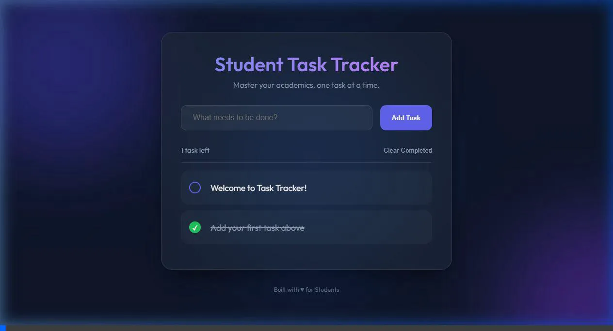

<div align="center">

# 🚀 Task Manager REST API


<br>


<br>

A **full-stack task management system** built with **Node.js, Express, PostgreSQL, and Vanilla JavaScript**.

🎓 Developed as part of the **Full-Stack Development Internship at Codveda Technologies**

</div>

---

## 📌 Project Overview

The **Task Manager REST API** is a simple full-stack application that allows users to manage tasks through a clean frontend interface connected to a backend API.

Users can **create, view, update, and delete tasks**, with all data stored in a PostgreSQL database.

This project demonstrates the core concepts of modern **full-stack development**, including:

* REST API design
* Database integration
* Frontend-backend communication
* CRUD operations
* Express server architecture

---

## ✨ Features

✔ Create new tasks
✔ View all tasks
✔ Update existing tasks
✔ Delete tasks
✔ REST API integration
✔ PostgreSQL database storage
✔ Simple responsive UI
✔ Full CRUD functionality

---

## 🛠️ Tech Stack

| Technology     | Purpose             |
| -------------- | ------------------- |
| **Node.js**    | Backend runtime     |
| **Express.js** | REST API framework  |
| **PostgreSQL** | Relational database |
| **HTML**       | Page structure      |
| **CSS**        | Styling             |
| **JavaScript** | Frontend logic      |

---

## 📂 Project Structure

```
task-manager-rest-api
│
├── public
│   ├── index.html
│   ├── style.css
│   └── script.js
│
├── server.js
├── db.js
├── package.json
├── package-lock.json
├── .gitignore
└── README.md
```

---

## ⚙️ Installation & Setup

### 1️⃣ Clone the repository

```bash
git clone https://github.com/yahyaegz/task-manager-rest-api.git
cd task-manager-rest-api
```

### 2️⃣ Install dependencies

```bash
npm install
```

### 3️⃣ Configure environment variables

Create a `.env` file in the root directory:

```
DB_USER=your_db_user
DB_HOST=localhost
DB_NAME=your_db_name
DB_PASSWORD=your_db_password
DB_PORT=5432
PORT=5000
```

### 4️⃣ Start the server

```bash
npm start
```

The application will run at:

```
http://localhost:5000
```

---

## 📡 API Endpoints

| Method | Endpoint         | Description             |
| ------ | ---------------- | ----------------------- |
| GET    | `/api/tasks`     | Retrieve all tasks      |
| POST   | `/api/tasks`     | Create a new task       |
| PUT    | `/api/tasks/:id` | Update an existing task |
| DELETE | `/api/tasks/:id` | Delete a task           |

---

## 🖥️ Application Workflow

1. Open the frontend page
2. Create a task
3. Tasks are stored in PostgreSQL
4. Tasks are dynamically displayed
5. Tasks can be updated or deleted

---

## 📷 Application Preview

### Student Task Tracker Interface



> A clean and modern task management interface where users can add, track, and manage their tasks efficiently.

---

## 🎓 Internship Context

This project was developed as part of the **Codveda Full-Stack Development Internship**.

It demonstrates the ability to:

* Build REST APIs using **Node.js & Express**
* Implement **CRUD operations**
* Integrate **PostgreSQL databases**
* Connect **frontend and backend systems**
* Design a simple **full-stack application architecture**

---

## 🚀 Future Improvements

Planned improvements for future versions:

🔐 JWT authentication system
📅 Task deadlines and reminders
🏷️ Task categories and tagging
⚛️ React frontend interface
☁️ Deployment to cloud hosting
📊 Dashboard and analytics

---

## 👨‍💻 Author

**Yahya Egzouli**

GitHub
https://github.com/yahyaegz

LinkedIn
https://www.linkedin.com/in/yahya-el-gzouli-99536b331

---

<div align="center">

⭐ **If you like this project, consider giving it a star!**


</div>
